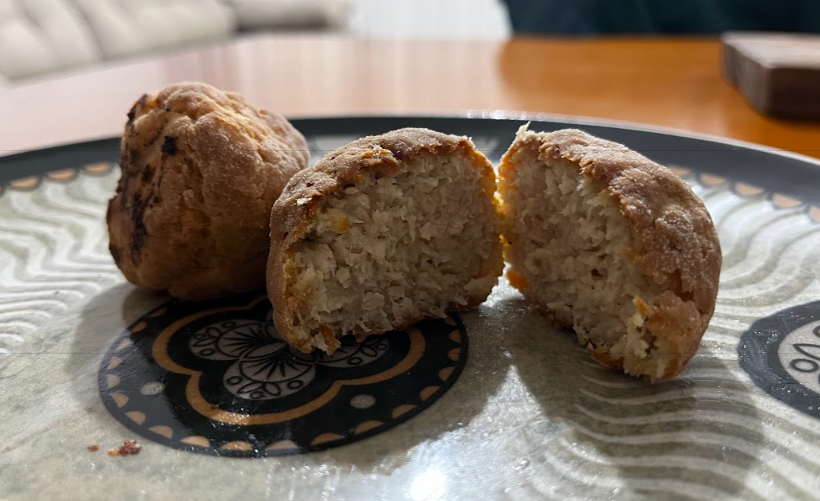

# Receita de Almôndega de Frango na Airfrier

Reseita criada por mim, na tentativa 1.
Com o tempo tentarei adaptá-la para melhorar o resultado.

Resultado Obtido até o momento: *Bolinhas com aparência de pão caseiro, casquinhas secas por fora, mas não duras, e bem suculentas por dentro.*

-----------------------------------------------------------------------------------------

## Ingredientes:

- `1 kg` de carne de frango moído (eu usei carne moida congelada mesmo);
- `1/2 un` limão thaiti espremido;
- `1 un` Ovo
- `1 col` Azeite de Oliva
- Orégano a gosto
- Sal a gosto
- Páprica a gosto
- Farinha de Trigo

-----------------------------------------------------------------------------------------

## Preparação:

1. **Preparar a massa:**
   - Misturar os frango, ovo, sal, orégano, azeite e páprica;
   - Quando a mistura estiver homogênea, comece a adicionar farinha até obter uma mistura úmida, mas que forme bolinhas consistentes;

2. **Fazer as bolinhas**
   - Faça as bolinhas, de tamanho um pouco menor do que um ovo;
   - Rolar as bolinhas na farinha de trigo e remover o excesso;

3. **Assar**
   - Leve para a Airfrier por `30min` a `185ºC`;
   - Após 15min, eu abri a airfrier e adicionei um pouco de azeite de oliva sobre as bolinhas, melhorou a textura delas;
     - Talvez deixa-lás umidas com azeite dê uma crocância bem legal (testarei na próxima)   

-----------------------------------------------------------------------------------------

**ESTA RECEITA ESTÁ EM TESTES**

By: **Will.i.am**
